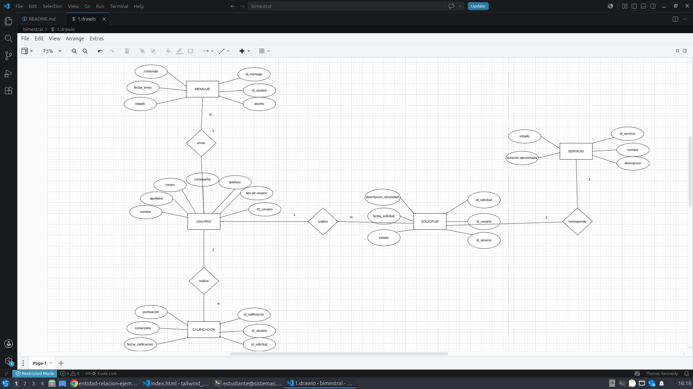
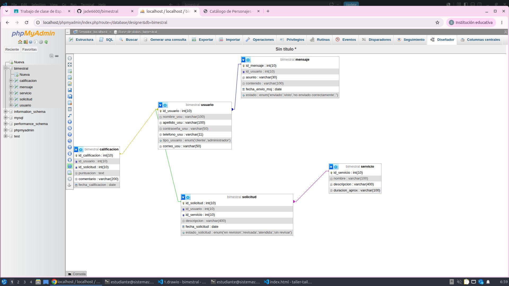
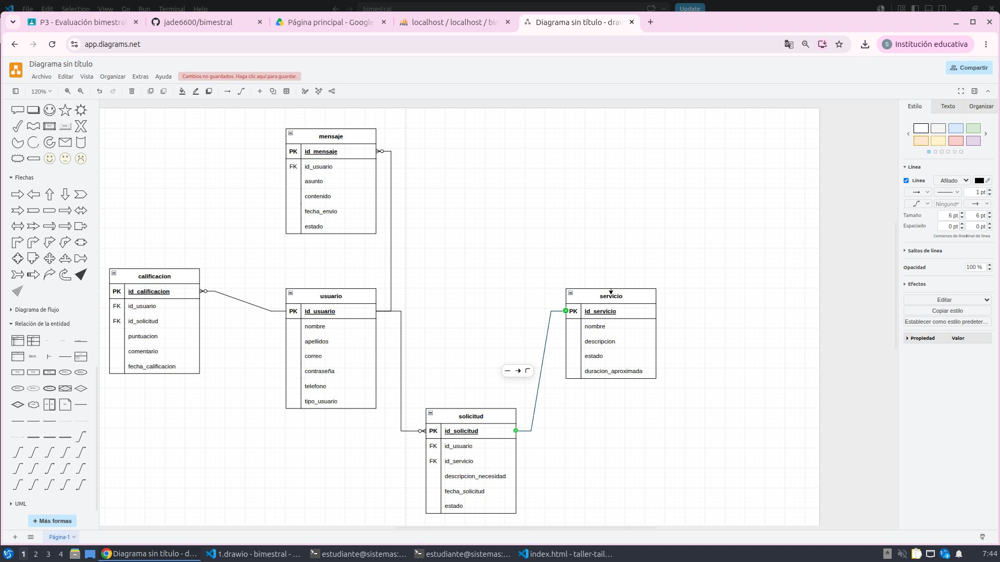
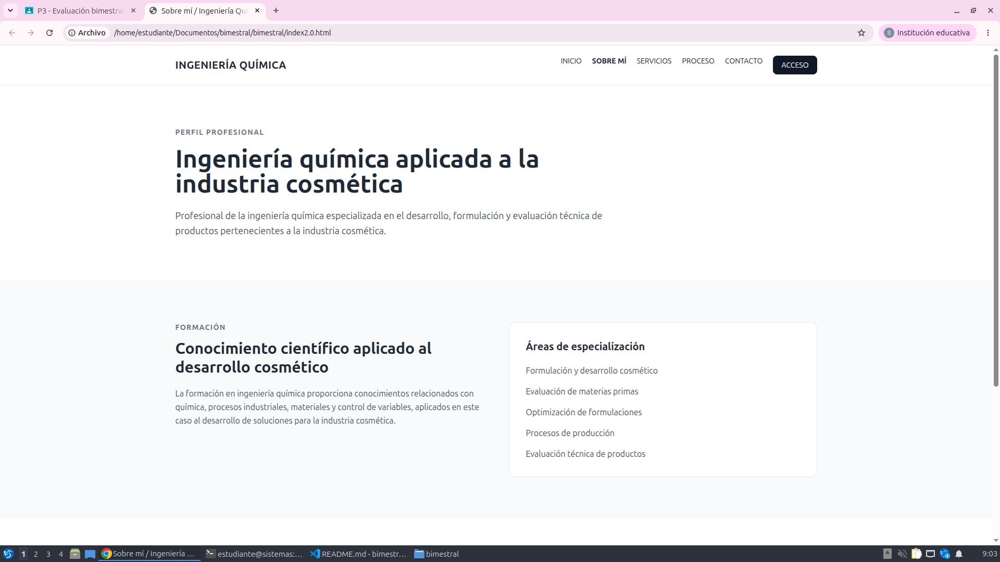

# bimestral
------------------------------------------------------------------------------------------------------------------------------------------------------------------
# Planteamiento del problema y diseño de la BD del sitio:

## causas:
- Los comercios y emprendimientos cosméticos pueden tener problemas para encontar asesoría técnica especailizada
- las solicitudes de asesoria pueden no estar organizadas en un sistema centralizado

## Problema
- Los comercios y emprendimientos del sector cosmético pueden presentar dificultades para acceder, solicitar y hacer seguimiento de servicios profesionales especializados en formulación y desarrollo cosmético mediante un medio digital organizado.

## Consecuencias
- Se dificulta el contacto entre los comercios y el profesional.
- Las solicitudes pueden quedar desorganizadas.
Puede haber pérdida o dispersión de información.
- El proceso de comunicación y atención puede resultar menos eficiente.

## Aporte
Mi sitio web buscará solucionar esto medianteUna plataforma web profesional que permita a los comercios conocer los servicios de asesoría y desarrollo cosmético, crear una cuenta, iniciar sesión, realizar solicitudes, comunicarse con la profesional y calificar los servicios recibidos.

------------------------------------------------------------------------------------------------------------------------------------------------------------------

# Épicas e historias de usuarios:

###  Épica: Gestión de usuarios

| Rol | Funcionalidad | Historia de Usuario | Información Adicional |
| :--- | :--- | :--- | :--- |
| **Cliente** | Servicio de registro | Yo como cliente quiero registrar mi cuenta en el sitio | Atiende al servicio de recolección correcta de los datos del cliente |
| **Cliente** | Inicio de sesión | Como cliente quiero iniciar sesión para acceder a mis funciones privadas | Atiende al servicio de inicio de sesión con contraseña y usuario |
| **Administrador** | Gestionar datos | Como administrador quiero gestionar la información de los usuarios registrados | El administrador gestiona los datos de los usuarios permitiendo un mayor orden |
###  Épica: Consulta de servicios

| Rol | Funcionalidad | Historia de Usuario | Información Adicional |
| :--- | :--- | :--- | :--- |
| **Cliente** | Consultar servicios | Como cliente quiero consultar información detallada de un servicio antes de solicitarlo | El usuario podrá visualizar todos los servicios y su información antes de decidir solicitarlo previamente |
###  Épica: Solicitud de servicios

| Rol | Funcionalidad | Historia de Usuario | Información Adicional |
| :--- | :--- | :--- | :--- |
| **Cliente** | Enviar una solicitud | Como cliente quiero solicitar un servicio para recibir atención profesional | El usuario podrá enviar una solicitud la cual será atendida de forma organizada |
| **Administrador** | Consultar solicitudes | Como administrador quiero consultar las solicitudes pendientes | El admin podrá visualizar y responder cada solicitud enviada |
###  Épica: Comunicación

| Rol | Funcionalidad | Historia de Usuario | Información Adicional |
| :--- | :--- | :--- | :--- |
| **Cliente** | Enviar mensajes o consultas | Como cliente quiero enviar mensajes para realizar consultas sobre los resultados | El cliente podrá preguntar directamente al admin sobre algún servicio |
| **Administrador** | Enviar y recibir mensajes | Como administrador quiero responder las consultas de los clientes | El administrador podrá responder al usuario manteniendo la comunicación |
###  Épica: Calificaciones

| Rol | Funcionalidad | Historia de Usuario | Información Adicional |
| :--- | :--- | :--- | :--- |
| **Cliente** | Calificar los servicios | Como cliente quiero calificar un servicio recibido | El cliente puede calificar los servicios |
| **Administrador** | Consultar las calificaciones | Como administrador quiero consultar las calificaciones realizadas por los clientes | El administrador puede visualizar las calificaciones para tenerlas en cuenta |

------------------------------------------------------------------------------------------------------------------------------------------------------------------

### MODELO ENTIDAD-RELACION
 

### MODELO FISICO
 

### MODELO ENTIDAD-RELACION
 

-----------------------------------------------------------------------------------------------------------------------------------------------------------------
### Diseño del frontend del sitio usando html y css: Primer version
-En esta version no tienen contenido las páginas adicionales, únicamente lo que se puede ver del index y no cuenta aun con la funcionalidad de iniciar sesion, en una proxima version se usara una hoja de estilo de css y se dara contenido a las siguientes páginas.

 

